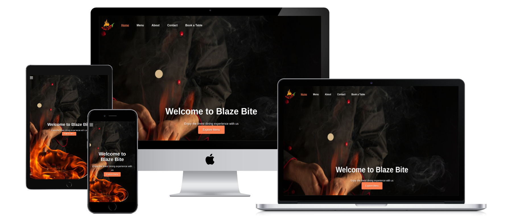
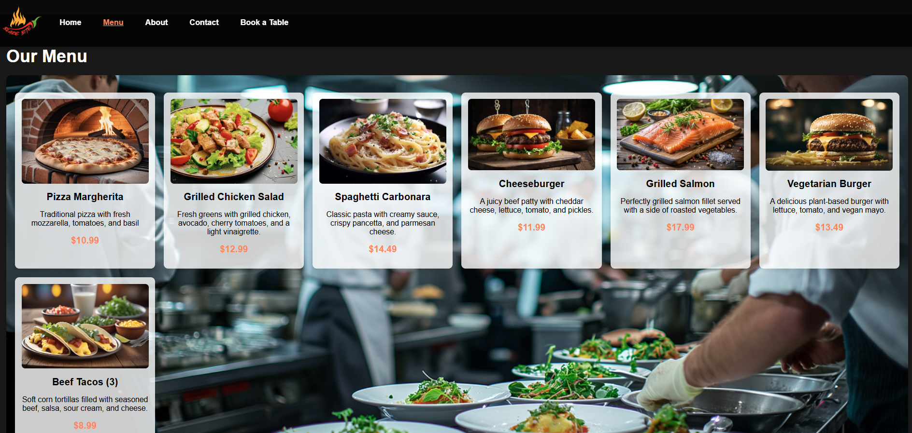

# Blaze Bite 

## A restaurant website.
> This website is a themed restaurant platform designed to showcase the restaurant’s menu, venue, and staff, providing an engaging user experience for potential customers. Key features of the site include:

Menu: A detailed, visually appealing menu display, giving customers an easy way to browse available dishes.
Staff: A profile page for staff members.
Reservation System: Customers can easily request reservations online, enhancing convenience and engagement.

The website is designed to provide users with a seamless, informative, and enjoyable experience, from exploring the menu to making a reservation.

### - By Doru Muresanu

## **[Live site](https://blaze-bite-31a3c3acf149.herokuapp.com/)**

---

## **[Repository](https://github.com/dmuresanu/blaze-bite-website)**

---
  
## Table of contents
<a name="contents">Back to Top</a>
 1. [ UX ](#ux)  
 2. [ Technology used ](#tech) 
 3. [ Testing ](#testing)  
 4. [ Bugs ](#bugs)  
 5. [ Deployment](#deployment)
 6. [ Credits](#credits)
 7. [ Content](#content)  
 8. [ Acknowledgements](#acknowledgements)  
 

## UX

#### Pre-project Planning

> Database Structure

- When I decided on my initial concept of Blaze Bite I knew I needed to understand what type of data I would need to store and the relationships between them.
- I created the above diagramto help guide me.
- As explained below I have decided to ommit some feature until a further release / iteration.

### Database Schema
#### MenuItem Model

| id | BigAutoField |
|--|--|
| category |CharField  |
| description |TextField|
|image|ImageField|
|name|CharField|
|price|DecimalField|

---

#### Booking Model

| id | BigAutoField |
|--|--|
| date |DateField|
|email|EmailField|
|full_name|CharField|
|number_of_people|Integerfield|
|phone_number|CharField|
|special_requests|CharField|
|time|TimeField|

---

#### StaffProfile Model

| id | BigAutoField |
|--|--|
|user|OneToOneField (id)|
|address|CharField|
|department|CharField|
|phone_number|CharField|
|position|CharField|
|profile_picture|ImageField|

---

# UX design

## Overview

Blaze Bite is a fictional restaurant that I created for my project. The primary objective of the website is to provide users with a glimpse of the venue through photos, showcase the restaurant’s offerings, and present the menu. If users find something they like, they can easily book a table. Additionally, the website allows restaurant staff to log in and manage the menu by adding, editing, or removing menu items as needed.

### Design
Once the name was chosen, I decided to design the website with a modern, minimalist aesthetic to create a clean and sleek appearance. The goal was to prioritize simplicity and ease of navigation while still offering a visually appealing user experience.

### Site User

 - Individuals looking to explore the restaurant, view the menu, check out photos of the venue, and make reservations.
 - Someone who would prefer to make bookings digitally rather than speaking with others
 - People who are curious about the restaurant or looking for a place to dine in a new area.
 - Employees who manage the website and update content, such as adding or editing menu items.

###  Goals for the website

 - Offer a seamless user experience with simple, intuitive navigation for both potential customers and restaurant staff. The website should be easy to navigate on all devices
 - Highlight the restaurant's ambiance and dining experience with high-quality images of the venue and dishes. Present the menu in a visually appealing and easy-to-read format to entice customers.
 - Provide a simple and straightforward booking system that lets users easily reserve a table online. This should be easy to access and quick to use, improving the overall customer experience.
 - Allow restaurant staff to log in securely and manage the menu by adding, updating, or removing items. 

## Features

#### Website features:

##### Dynamic Menu listings

 - The website displays dynamic menu that is updated on the back end and on the front-end depending 
 - This allows the business owner to make easy changes, change pricing, dishes, or even descriptions easily.

##### Booking System

 -A user can book a table with the business.
 
#### Desktop

> Desktop Navigation

 - The desktop navigation includes links to Home, Menu, About, Contact, Book a Table, and Staff Login when the user is not logged in. Once logged in, the navigation updates to include a Profile link.
 

---

> Menu 

- The menu section consists of Starters, Main Courses and Deserts. 
- A customer can see the details of each dish and the price.

---

> About

- Customers can meet the restaurant team and find more about the restaurant

  
---

> Contact

- On the Contact page users can find the location, opening hours but also the 
 contact form.

---

> Book a Table

- On the Book a Table page it is just the form.

---

> Staff Login

- On the Staff Login page, staff members can log in to their accounts.

---

> Mobile Navigation

- I utilized Bootstrap to ensure that my site is optimally displayed on mobile devices, providing the best possible user experience.

---

> Staff Profile

- The staff profile section displays the image for the user along with the personal details.
- The user can amend all personal information.

---

> Staff Profile on mobile

- Staff profile on mobile stacks in a column on mobile.

[Back to Top of page](#contents)

---

##  Technology Used

### Html

 - Used to organize the layout of my webpages and as the foundation for the templating language.

### CSS

 - CSS was utilized in this project to enhance the visual design, ensuring the site was both aesthetically pleasing and functional across different devices and screen sizes.

### Python

 -  Used in this project to handle the backend functionality, enabling dynamic content management, user authentication, and seamless form submissions, ensuring a smooth and interactive user experience.

### Django

 -  Django was used in this project as the web framework to efficiently manage the site's backend, handling URL routing, database models, form processing, and user authentication, allowing for rapid development and a scalable architecture.

### Bootstrap 
 - Bootstrap was utilized in this project to streamline the development of a responsive and visually appealing layout, ensuring the website adapts seamlessly across different devices and screen sizes with its pre-built grid system and UI components.

### Mailtrap 
 - I used Mailtrap with my project to test and debug email functionality in a safe, isolated environment without sending actual emails, ensuring reliable email delivery and correct formatting

 ### Flatpickr with Django
 - I used Flatpickr in my project to provide a user-friendly, customizable date and time picker, enhancing the booking experience by allowing users to easily select reservation dates and times while preventing the selection of past dates.

### GitHub
 - Used for version control and collaboration throughout the project, allowing me to track changes, manage code revisions, and ensure seamless coordination with team members while maintaining an organized repository of the website's development.

### Heroku
- Used to deploy the website, providing a reliable and scalable platform to host the application. It allowed for easy integration with the backend, seamless updates, and ensured the site was accessible to users worldwide.

### Heroku PostgreSQL
-Heroku PostgreSQL was used as the database for this project during development and in production.

### Cloudinary
- Was utilized to manage and optimize media files such as images on the website. It provided a fast and efficient way to store, deliver, and transform images, ensuring quick load times and a seamless user experience.

### Git
- Used for version control throughout the development process, allowing me to track changes, collaborate effectively, and maintain a history of the project's progress. It ensured that the codebase remained organized and enabled efficient management of updates and bug fixes

[Back to Top of page](#contents)

---

## Testing

## Google Lighthouse Testing

### Desktop

> index.html

> menu.html

> about.html

> contact.html

> booking.html

> login.html

> staff_profile.html

## HTML W3 Validation

### index.html

#### Result: No Errors

### CSS Validation

#### Result: Pass - No Errors

[Back to Top of page](#contents)

---

## **Bugs**

#### Django templating bug

- When I ran my code through the W3 HTML Validator, I got this error: 'Element <a> not allowed as child of element <ul> in this context.' 
- This error occurred because the <a> tag was placed directly inside the <ul> without being properly nested within a <li>. 
- To fix this, I moved the <a> tag outside of the <ul> element and placed it above it, ensuring the code complies with HTML standards and maintains proper semantic structure.

[Back to Top of page](#contents)

---

## Deployment

> I have broken up the deployment into two sections as it is quite extensive and can be hard to follow.

To deploy the project through Heroku I followed these steps:

- Sign up / Log in to  [Heroku](https://www.heroku.com/)
- From the main Heroku Dashboard page select 'New' and then 'Create New App'
- Give the project a name - I decided on the devils kitchen and selected EU as that is the closes region to me.
- After this you select select create app. 
- The name for the app must be unique or you will not be able to continue.
- Heroku will create the app and bring you to the deploy tab. 
- From the submenu at the top, navigate to the resources tab.
- Add the database to the app, in the add-ons section search for 'Heroku Postgres', select the package that appears and add 'Heroku Postgres' as the database
- Click on the setting tab
- Open the config vars section copy the DATABASE_URL to the clipboard for use in the Django configuration.
- Inside the Django app repository create a new file called env.py
- within this file import the os library and set the environment variable for the DATABASE_URL pasting in the address copied from Heroku. 
- The line should appear as os.environ["DATABASE_URL"]= "Paste the link in here"
-   Add a secret key to the app using os.environ["SECRET_KEY"] = "your secret key goes here"
-   Add the secret key just created to the Heroku Config Vars as SECRET_KEY for the KEY value and the secret key value you created as the VALUE
-   In the settings.py file within the django app, import Path from pathlib, import os and import dj_database_url
-   insert the line if os.path.isfile("env.py"): import env
-   remove the insecure secret key that django has in the settings file by default and replace it with SECRET_KEY = os.environ.get('SECRET_KEY')
-   replace the databases section with DATABASES = { 'default': dj_database_url.parse(os.environ.get("DATABASE_URL"))} ensure the correct indentation for python is used.
-   In the terminal migrate the models over to the new database connection
---
-   Navigate in a browser to cloudinary, log in, or create an account and log in.
-   From the dashboard - copy the CLOUDINARY_URL to the clipboard
-   In the env.py file - add os.environ["CLOUDINARY_URL"] = "paste in the Url copied to the clipboard here"
-   In Heroku, add the CLOUDINARY_URL and value copied to the clipboard to the config vars
-   Also add the KEY - DISABLE_COLLECTSTATIC with the Value - 1 to the config vars
-   this key value pair must be removed prior to final deployment
-   Add the cloudinary libraries to the list of installed apps, the order they are inserted is important, 'cloudinary_storage' goes above 'django.contrib.staitcfiles' and 'cloudinary' goes below it.
-   in the Settings.py file - add the STATIC files settings - the url, storage path, directory path, root path, media url and default file storage path.
-   Link the file to the templates directory in Heroku TEMPLATES_DIR = os.path.join(BASE_DIR, 'templates')
-   Change the templates directory to TEMPLATES_DIR - 'DIRS': [TEMPLATES_DIR]
-   Add Heroku to the ALLOWED_HOSTS list the format will be the app name given in Heroku when creating the app followed by .herokuapp.com
-   In your code editor, create three new top level folders, media, static, templates
-   Create a new file on the top level directory - Procfile
-   Within the Procfile add the code - web: guincorn PROJECT_NAME.wsgi
-   In the terminal, add the changed files, commit and push to GitHub
-   In Heroku, navigate to the deployment tab and deploy the branch manually - watch the build logs for any errors.
-   Heroku will now build the app for you. Once it has completed the build process you will see a 'Your App Was Successfully Deployed' message and a link to the app to visit the live site.

[Back to Top of page](#contents)

---
  

## Credits
  
##### Corey Schafer
  - I referred to Corey Schafer's YouTube tutorials, particularly his videos on Django signals and extending the user model.
  - His clear and practical explanations provided a solid foundation and deepened my understanding of these advanced concepts.
  - While I used his tutorials as an initial guide, I also followed up with the official Django documentation to tailor the implementation to the specific needs of my project.

##### Pixbay
  - All images used in this project were sourced from Pixabay. Credit and gratitude are owed to the talented photographers and creators who generously shared their work for free public use.
  

[Back to Top of page](#contents)

---

## Content & Resources
  
##### Django Documentation
  - Referred to the Django documentation extensively, particularly when implementing models and other core features. It provided invaluable guidance and clarity.
  
##### W3 Schools
  - Used as a quick reference for CSS examples and best practices.
  
##### Code Institute
  - The course content for Portfolio Project 4 was instrumental in the successful completion of this project.
  - The walkthroughs were clear, well-paced, and provided a solid foundation for understanding Django and web development concepts.
  - The initial project structure was heavily influenced by the CI walkthrough until I gained confidence with the framework and customized it to suit my vision.
  - Some remnants of legacy code, particularly regarding the navigation bar, remain from the original walkthrough.

[Back to Top of page](#contents)

---

## Acknowledgements

### The tutors at Code institute
> To all the tutors in CI, thank you for your patience. 

